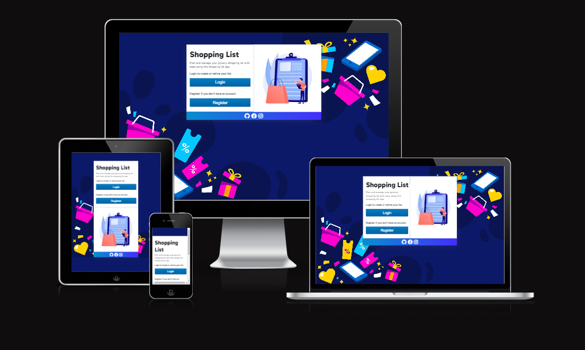
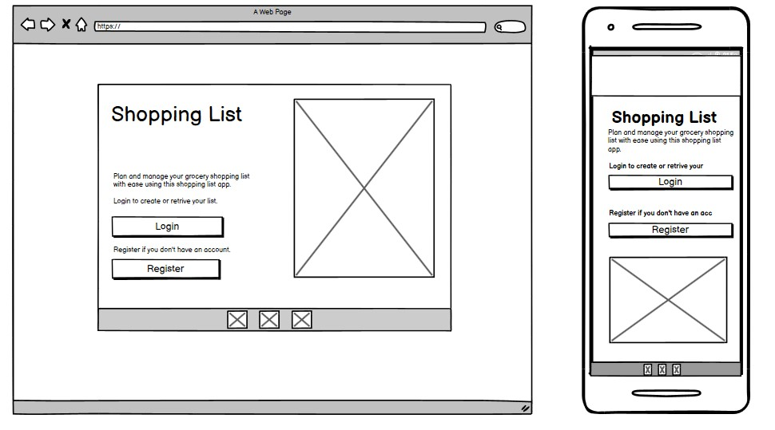
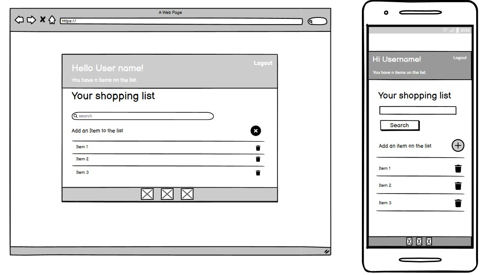
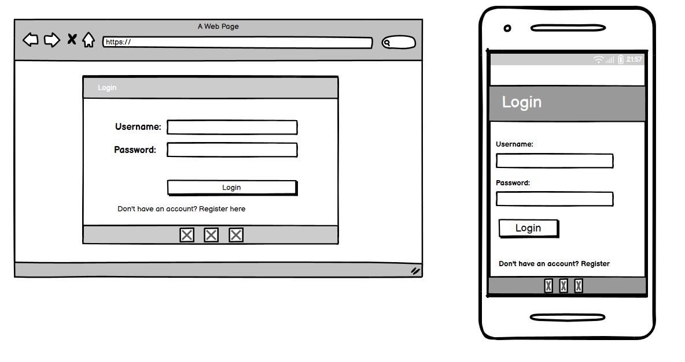
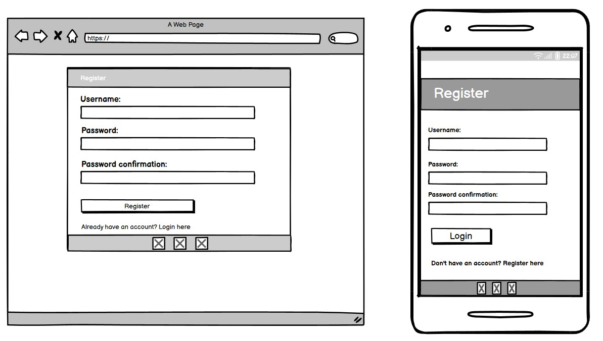
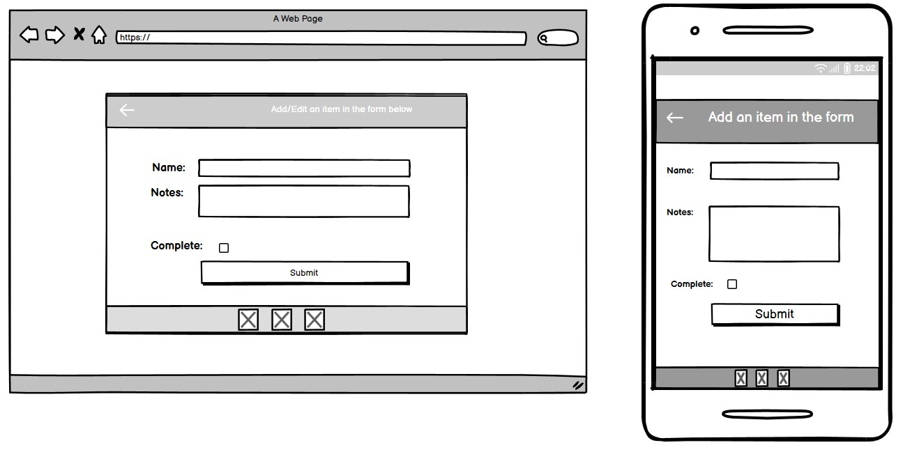
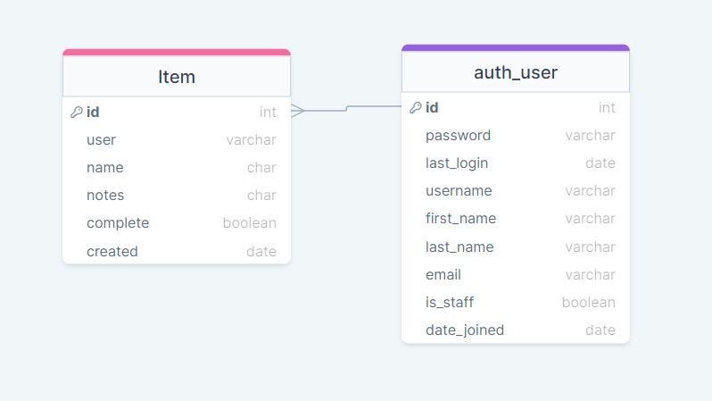

# The Shopping list app

The Shopping List App is a web application built using the Django web framework. This app is designed to help users easily create and manage their shopping lists. It allows users to add, edit, and delete items on their list, as well as mark items as purchased. 

The live version of this app is located [here](https://slbabin-shopping-list-528699dcec84.herokuapp.com). 

## Table Of Contents:
1. [Design](#design)
    * [User Stories](#user-stories)
    * [Wireframes](#wireframes)
    * [Agile Methodology](#agile-methodology)
    * [Database Diagram](#database-diagram)

# User Stories
User stories are a great way to define the functionality and features of a shopping list app from the perspective of the end users. Here are some user stories for a shopping list app:
As a user, I want to be able to create a new shopping list so that I can organize and plan my shopping needs.

- As a user, I can register and create an account in the app.
- As a user, I can login or logout from the app, so that can view the list of items created by me only and no one else can access my list.
- As a user, I want to be able to add items to my shopping list to keep track of what I need to purchase.
- As a user, I should be able to click on the item in the list and see the details about that particular item.
- As a user, I can edit an item on the list that I added so that I can update or make changes to that item.
- As a user, I should be able to delete items added by me.
- As a user, I want to be able to mark items as purchased when I buy them, so I can keep my list up to date.
- As a user, I want to be able to easily search for items in my shopping list to quickly locate and manage them.
- As a user, I want to be able to view and edit my shopping list on multiple devices (e.g., smartphone, tablet, web browser) for convenience and accessibility.

# Wireframes 

Wireframes provide a visual representation of the app's layout and structure, making it easier to conceptualize and understand the overall design and functionality. 

    
Start Page
  

  

  

    
List Page
  
    
  

  

    
Login Page
  
    
  

  

    
Register Page
  
    
  

 
  

    
Add/Update Page
  
    
  

# Agile methodology

GitHub is a powerful platform for version control. In addition it can be effectively used to support agile methodologies. Github Projects was used to track the development of this app using the agile approach. The project can be found [here](https://github.com/users/slbabin/projects/5).

# Database Diagram

The database diagram was created using [draqSQL](https://drawsql.app).
  

# Features 

- User Registration and Authentication: Users can create accounts, log in, and manage their shopping lists securely.
- Add Items: Users can add items to their shopping lists, specifying the item name and optional notes.
- Edit and Delete Items: Users can edit item details or remove items from their lists.
- Mark Items as Purchased: Users can mark items as purchased, making it easy to keep track of what they've already bought.
- Search option:  Users can search the list of item in order to manage the shopping list more efficiently.

