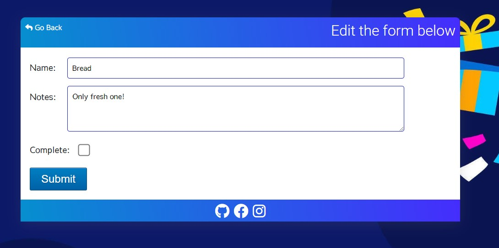
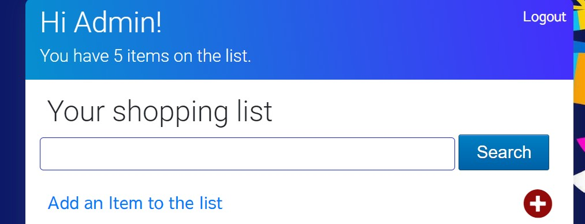

# The Shopping list app

The Shopping List App is a web application built using the Django web framework. This app is designed to help users easily create and manage their shopping lists. It allows users to add, edit, and delete items on their list, as well as mark items as purchased. 

The live version of this app is located [here](https://slbabin-shopping-list-528699dcec84.herokuapp.com). 

## Table Of Contents:
1. [Design](#design)
    * [User Stories](#user-stories)
    * [Wireframes](#wireframes)
    * [Agile Methodology](#agile-methodology)
    * [Database Diagram](#database-diagram)

# User Stories
User stories are a great way to define the functionality and features of a shopping list app from the perspective of the end users. Here are some user stories for a shopping list app:
As a user, I want to be able to create a new shopping list so that I can organize and plan my shopping needs.

- As a user, I can register and create an account in the app.
- As a user, I can login or logout from the app, so that can view the list of items created by me only and no one else can access my list.
- As a user, I want to be able to add items to my shopping list to keep track of what I need to purchase.
- As a user, I should be able to click on the item in the list and see the details about that particular item.
- As a user, I can edit an item on the list that I added so that I can update or make changes to that item.
- As a user, I should be able to delete items added by me.
- As a user, I want to be able to mark items as purchased when I buy them, so I can keep my list up to date.
- As a user, I want to be able to easily search for items in my shopping list to quickly locate and manage them.
- As a user, I want to be able to view and edit my shopping list on multiple devices (e.g., smartphone, tablet, web browser) for convenience and accessibility.

# Wireframes 

Wireframes provide a visual representation of the app's layout and structure, making it easier to conceptualize and understand the overall design and functionality. 

    
Start Page
  

  

  

    
List Page
  
    
  

  

    
Login Page
  
    
  

  

    
Register Page
  
    
  

 
  

    
Add/Update Page
  
    
  

# Agile methodology

GitHub is a powerful platform for version control. In addition it can be effectively used to support agile methodologies. Github Projects was used to track the development of this app using the agile approach. The project can be found [here](https://github.com/users/slbabin/projects/5).

# Database Diagram

The database diagram was created using [draqSQL](https://drawsql.app).
  

# Features 

- **User-friendly design**: The app has a container desing which is accessible and user-friendly on various devices, including mobile phones and tablets.
 

- **User Registration and Authentication:** Users can create accounts, log in, and manage their shopping lists securely.
 

- **Add Items:** Users can add items to their shopping lists, specifying the item name and optional notes.
 

- **Edit items:** Users can edit item details.
 

- **Delete items:** User can remove items from their list. 
 

- **Delete confirmation:** Users presented with the delete confirmation message. 
 

- **Mark Items as Purchased:** Users can mark items as purchased, making it easy to keep track of what they've already bought.
 

- **Search items:**  Users can search the list of item in order to manage the shopping list more efficiently.
 

# Future Features

 There are a few fetures that I would like to implement in the future releases.
 - To be able to set a budget for the shopping list and track expenses as users add items to it.
 - Be able to share the shopping list with family or friends, so they can collaborate on the shopping needs.
 - Be able to see the total cost of items on the shopping list to help the user stay within their budget.

 # Technologies Used
 - [Django](https://www.djangoproject.com/) - a free and open-source, Python-based web framework that follows the model–template–views (MTV) architectural pattern.
 - [Python](https://www.python.org/) - a high-level, general-purpose programming language. 
- [Bootstrap](https://getbootstrap.com/) - a free front-end framework for faster and easier web development.
- [HTML](https://en.wikipedia.org/wiki/HTML) - the standard markup language for Web pages.
- [CSS](https://en.wikipedia.org/wiki/CSS) -  a style sheet language used for describing the presentation of a document written in a markup language such as HTML.
- [JavaScript](https://en.wikipedia.org/wiki/CSS)- a lightweight interpreted  programming language with first-class functions.
- [Balsamiq](https://balsamiq.com/) - a user interface design tool for creating wireframes (sometimes called mockups or low-fidelity prototypes). 
- [Github](https://en.wikipedia.org/wiki/GitHub) - a platform and cloud-based service for software development and version control using Git.
- [Gitpod](https://www.gitpod.io/) - a cloud development environment to efficiently and securely develop software. 
- [Codeanywhere](https://codeanywhere.com/) - a cross-platform cloud integrated development environment (IDE), alternative IDE to Gitpod.
- [ElephantSQL](https://www.elephantsql.com/) - a PostgreSQL database hosting service.
- [Heroku](https://heroku.com) - a platform as a service (PaaS) that enables developers to build, run, and operate applications entirely in the cloud.

# Testing
## User story testing
##### About The app 
*As a User I want to understand what the app is about.*
- On the app start page there is information that- cleary tells the user the purpose of the app.

##### Register
*As a User I can Create an account so that I can add my items to the shopping list.*
- On the app start page there is a big Registration button.  If a User clicks on this button, they will be redirected to the registeration page where they can sign up. Once they sign up they will be able to access the list they created.

##### Login / Logout
*As a User I can Login/Logout so that I can access my own data when logged in, and log out so that no one can access my account and view items created by me.*
- When a User is not logged in the Login button is visible in the center of the app. Once clicking on the button, the user redirected to the login page where they need to enter their user name and password. In the top right corner of the app the user will see the option to logout from the account. 
- After clicking on Logout button, the user automatically redirected to the app start page.

##### View Shopping list items
*As a User I can see the list of shopping list items and clicking on an item would open the item details.*
- The User must be logged into the app or the shopping list will not be visible. If the User is logged in they can click on one of the items on the list and this will take them to that form with item details.

##### Add item
*As a User I can add an item to the shopping list*
- When a user is logged into the app they are able to click on the 'Add an Item' link or the +Add icon, which will bring them to the Add Item form where they are able to add item details.

##### Edit item
*As a User I can edit an item detail*
- When a user is logged into the app they are able to click on one of the items on the list and this will open the form with prepopulated with item detail fields.

##### Delete item
*As a User I can delete an item from the shopping list*
- When a user is logged into the app they are able delete the item from the shopping list by clicking the Delete icon.

##### Search the shopping list
*As a User I can search the shopping list for an item*
- On the shopping list page there is a search bar which allows to search for an item on the list.

## Manual Testing
| Feature               | Test Performed                                                     | Result  |
|-----------------------|--------------------------------------------------------------------|---------|
| Login button | Clicking on the button redirect to the login form.                          | Pass    |
| Register button | Clicking on the button redirects to the registration form.               | Pass    |
| Create item | Clicking on the 'Add an Item to the list' allows to add a new item.          | Pass    |
| Edit item | Clicking on the item in the list opens the prepopulated items details which can be updated.| Pass    |
| Delete item  | Clicking on the Delete icon first opens a confirmation page and then deletes the item.   | Pass    |
| Header title  | Make sure that the correct title displayed when open either the Add or Edit form.  | Pass    |
| Login/Logout link | When logged in the app, the link in the top right corner changes to 'Logout'.  | Pass    |
| Responsiveness | Checked to make sure that the app layout changes depending on the viewed devices         | Pass      |
| Footer social icons | Clicking on social icon in the footer opens the correct web address in the new tab.       | Pass      |

## Code Validation

##### HTML validation
 

##### CSS validation
 